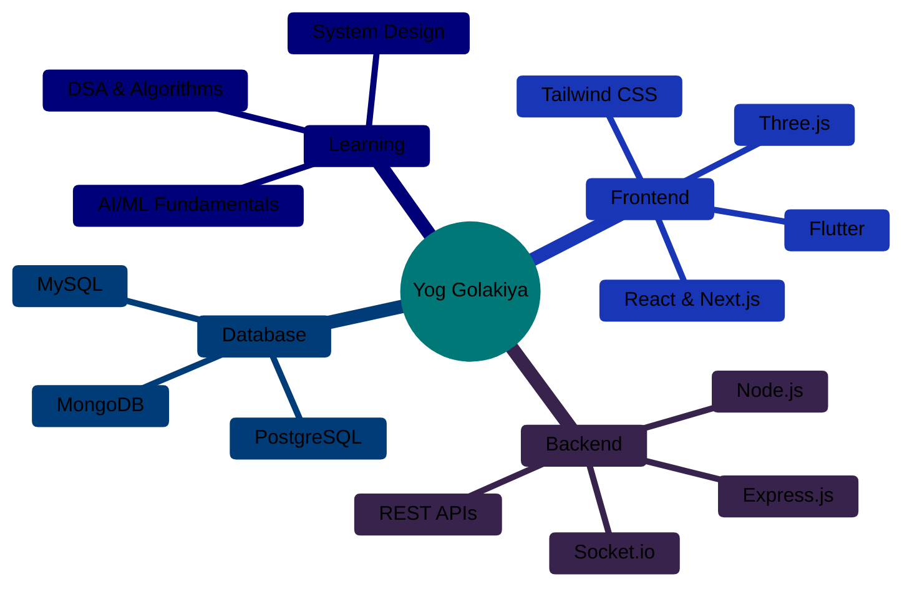

# 🌐 Yog Golakiya

### Full Stack Developer | Web & App Development | AI/ML Enthusiast

**Future AI/ML Graduate Student**

---

## 🚀 About Me

I'm a passionate **Full Stack Developer** specializing in modern web and mobile application development. Currently focused on building high-performance, scalable solutions while deepening my expertise in competitive programming and preparing for advanced studies in AI/ML.

- 🏗️ **Currently Working On:** Flutter & React-based applications with emphasis on clean architecture
- 📚 **Learning:** Advanced DSA, System Design, and AI/ML fundamentals
- 🎯 **Goal:** Ship one meaningful project every month
- 💻 **Daily Practice:** Competitive programming on Codeforces
- 🎓 **Next Step:** Master's degree in Artificial Intelligence/Machine Learning

---

## 🛠️ Technical Arsenal

### **Languages**

### **Frontend Development**

### **Backend Development**

### **Databases**

### **Cloud & Deployment**

### **Additional Tools**

---

## 🎯 Current Focus & Expertise

---

## 💼 Featured Projects & Contributions

<table>
  <tr>
    <td align="center" width="33%">
      
       <b>Clean Code</b>
       Writing maintainable, scalable solutions
    </td>
    <td align="center" width="33%">
      
       <b>Problem Solving</b>
       Daily practice on Codeforces
    </td>
    <td align="center" width="33%">
      
       <b>Full Stack</b>
       End-to-end application development
    </td>
  </tr>
  <tr>
    <td align="center" width="33%">
      
       <b>Fast Learner</b>
       Always exploring new technologies
    </td>
    <td align="center" width="33%">
      
       <b>Team Player</b>
       Open to collaboration & contributions
    </td>
    <td align="center" width="33%">
      
       <b>Goal-Oriented</b>
       One project per month commitment
    </td>
  </tr>
</table>

---

## 📈 Contribution Graph

  

---

## 🤝 Open for Collaboration

I'm always interested in collaborating on:

<table align="center">
  <tr>
    <td align="center" width="50%">
      
       <b>Open Source Projects</b>
       Frontend/Full Stack contributions
    </td>
    <td align="center" width="50%">
      
       <b>Startup Ideas</b>
       Web, mobile apps, or AI-powered solutions
    </td>
  </tr>
  <tr>
    <td align="center" width="50%">
      
       <b>Learning Projects</b>
       Where we can grow together
    </td>
    <td align="center" width="50%">
      
       <b>Real-World Applications</b>
       Making an impact through technology
    </td>
  </tr>
</table>

---

## 🌐 Connect With Me

  

---

  
### 💭 *"Code. Learn. Build. Repeat."*

<!-- Footer Wave -->

